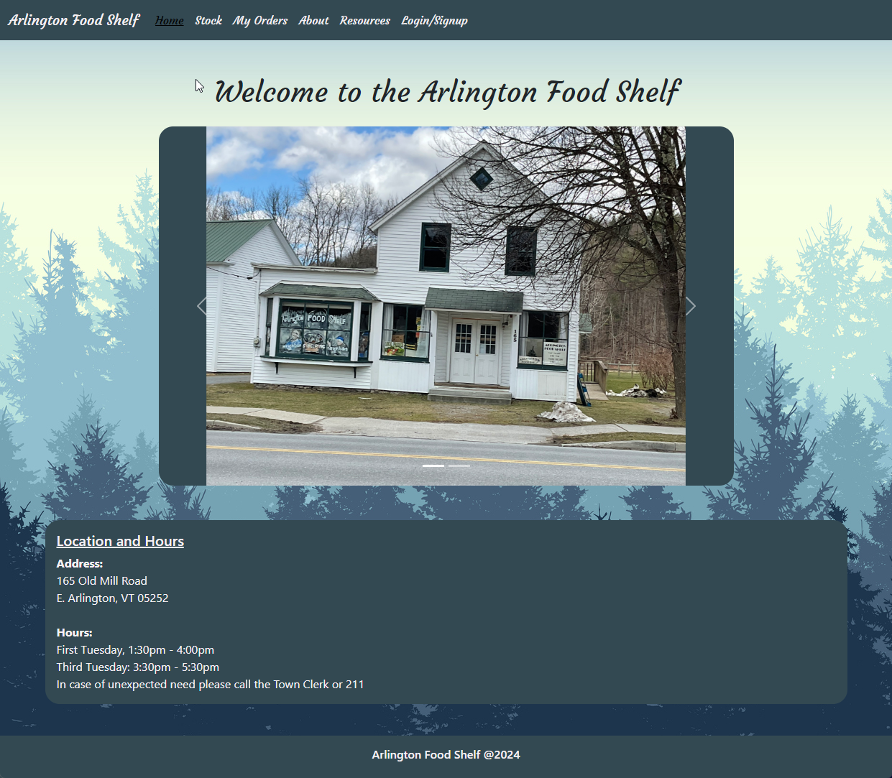

## Arlington Food Shelf

### Description

The Arlington Food Shelf is an organization in Arlington, VT. that provides food free of charge to anyone in need. They've been providing this service without any real way to communicate to their customers what food is available or what they can select to place an order for pick up later in the day.

### Usage

Now the organization has an official page: https://arlingtonfoodshelf.com/
They can use this to provide various services such as:

- What foods are currently in stock
- User sign in to place an order
- Providing various other resources for those in need
- An official page to communicate with the community

### Homepage Screenshot

### Requirements

The website was built using:

- Express
- Express-Session
- Sequelize
- Google-Map API
- Handlebars
- Bootstrap

### Contributors

The team consisted of:

- @Pematamang111
- @SuperRonanCraft
- @Stewpra
- @vpontual
- @norashala

### License

    Licensed under the MIT License license.
